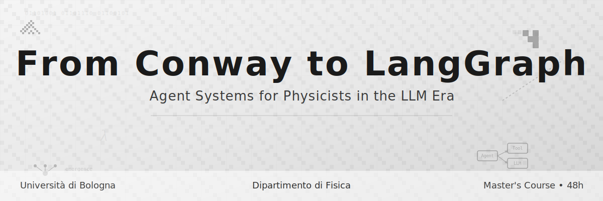

# From Conway to LangGraph
## Agent Systems for Physicists in the LLM Era

<div align="center">



**A 48-hour Master's course bridging Cellular Automata and Modern AI Agents**

[](https://creativecommons.org/licenses/by-nc-sa/4.0/)
[](https://www.python.org/downloads/)
[](https://github.com/psf/black)


</div>

---

## 🎯 Course Overview

> *"How do simple local rules give rise to complex global behavior?"*

This course explores **emergence** — from Conway's cellular automata (1970) to today's multi-agent LLM systems. Students learn to:

- 🧮 **Formalize** emergence using statistical mechanics & information theory
- 💻 **Simulate** agent systems from first principles (Python/Mesa)
- 🤖 **Build** AI agents using foundation models (LangChain/LangGraph)
- 🔬 **Apply** these tools to physics research problems

---

## 📚 Course Structure

**12 weeks • 48 hours • Theory + Hands-on Labs**

<table>
<tr><th>Weeks</th><th>Topic</th><th>Key Concepts</th><th>Tools</th></tr>

<tr>
<td><strong>1</strong></td>
<td><a href="week01_elementary_ca/">Cellular Automata</a></td>
<td>Emergence, Wolfram's classes</td>
<td>NumPy, Matplotlib</td>
</tr>
<tr>
<td><strong>2</strong></td>
<td><a href="week02_game_of_life/">Game of Life</a></td>
<td>Emergence, Entropy and Irreversibility</td>
<td>NumPy, Matplotlib</td>
</tr>

<tr>
<td><strong>3-4</strong></td>
<td><a href="week03_schelling_model/">Statistical Mechanics of Agents</a></td>
<td>Scelling Model,Phase transitions, Self organized ciritcality, mean-field theory</td>
<td>Mesa, Python</td>
</tr>

<tr>
<td><strong>5-6</strong></td>
<td><a href="week05_reinforcement_learning/">RL & Evolutionary Learning</a></td>
<td>Q-learning, MARL, genetic algorithms</td>
<td>Gymnasium, NumPy</td>
</tr>

<tr>
<td><strong>7-8</strong></td>
<td><a href="week07_llm_introduction/">Foundation Models</a></td>
<td>Transformers, prompting, tool use</td>
<td>Ollama, OpenAI API</td>
</tr>

<tr>
<td><strong>9-10</strong></td>
<td><a href="week09_langchain_basics/">LangChain & LangGraph</a></td>
<td>Chains, agents, memory, tools</td>
<td>LangChain, ChromaDB</td>
</tr>

<tr>
<td><strong>11-12</strong></td>
<td><a href="week11_multiagent_systems/">Multi-Agent Systems</a></td>
<td>Coordination, collaboration, emergence</td>
<td>LangGraph, AutoGen</td>
</tr>

</table>

---

## 🚀 Quick Start

### Prerequisites

- **Background:** Physics (statistical mechanics, dynamical systems)
- **Programming:** Python intermediate (OOP, NumPy)


### Installation (5 minutes)

```bash
# 1. Clone repository
git clone https://github.com/mirko-degli-esposti/conway-to-langgraph.git
cd conway-to-langgraph

# 2. Create environment
conda env create -f environment.yml
conda activate conway-langgraph

# 3. Verify setup
python scripts/verify_setup.py

# 4. Launch Jupyter
jupyter lab
```


---

## 📖 How to Use This Repository

### For Students

1. **Each week:**
   - Read `weekXX_topic/README.md` for overview
   - Complete Jupyter notebooks in `notebooks/`
   - Solve exercises in `exercises/


## 📅 **Course Calendar** 
[https://www.unibo.it/en/study/course-units-transferable-skills-moocs/course-unit-catalogue/course-unit/2025/535121/orariolezioni]

---


## 📜 License

- **Course Materials:** [CC BY-NC-SA 4.0](LICENSE-CC-BY-NC-SA) - Free for educational use
- **Code Examples:** [MIT License](LICENSE-MIT) - Free to use/modify
- **Attributions:** See [CREDITS.md](CREDITS.md)

---

## 👨‍🏫 Instructor

**Mirko Degli Esposti**  
[Full Prof. in Mathematical Physics, Department of Physics and Astronomy]  
[University of Bologna]  

**Contact:**
- 📧 Email: [mirko.degliesposti@unibo.it]

## 🗺️ Repository Navigation

```
📦 conway-to-langgraph/
 ┣ 📂 week01_elementary_ca/        ← Start here!
 ┣ 📂 week02_game_of_life/
 ┣ 📂 docs/                        ← Setup, bibliography, syllabus
 ┣ 📂 scripts/                     ← Utility scripts
 ┣ 📂 projects/                    ← Midterm & final projects
 ┣ 📜 environment.yml              ← Conda environment
 ┣ 📜 README.md                    ← You are here!
 └ 📜 LICENSE
```

---

<div align="center">

**Ready to explore emergence from Conway to LangGraph?** 🚀

[**Get Started →**](week01_elementary_ca/)

---


*Last updated: February 2026*

</div>
