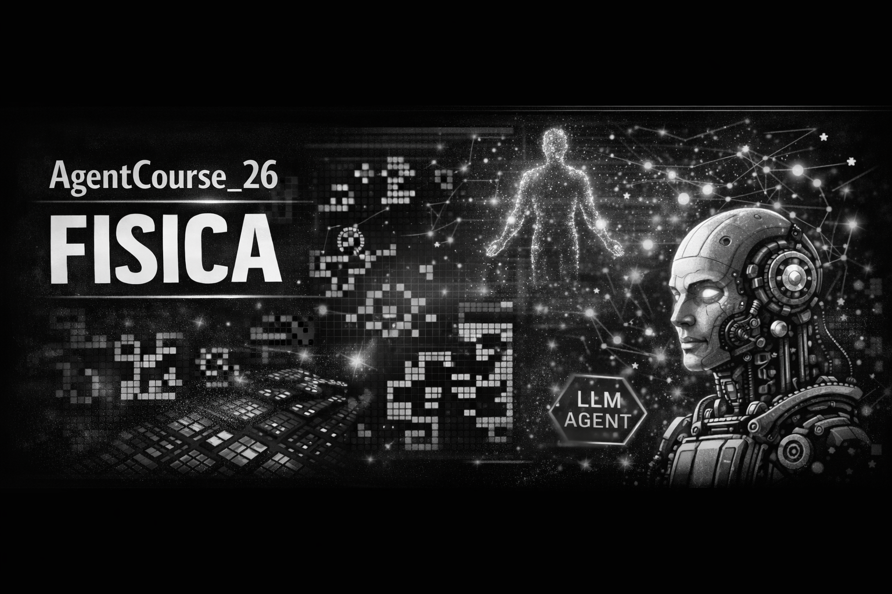

# From Conway to LangGraph
## Agent Systems for Physicists in the LLM Era

<div align="center">



**A 48-hour Master's course bridging Cellular Automata and Modern AI Agents**

[](https://creativecommons.org/licenses/by-nc-sa/4.0/)
[](https://www.python.org/downloads/)
[](https://github.com/psf/black)


[**Syllabus**](docs/syllabus.md) • [**Setup Guide**](docs/setup_guide.md) • [**Bibliography**](docs/bibliography.md) • [**Discussions**](../../discussions)

</div>

---

## 🎯 Course Overview

> *"How do simple local rules give rise to complex global behavior?"*

This course explores **emergence** — from Conway's cellular automata (1970) to today's multi-agent LLM systems. Students learn to:

- 🧮 **Formalize** emergence using statistical mechanics & information theory
- 💻 **Simulate** agent systems from first principles (Python/Mesa)
- 🤖 **Build** AI agents using foundation models (LangChain/LangGraph)
- 🔬 **Apply** these tools to physics research problems

---

## 📚 Course Structure

**12 weeks • 48 hours • Theory + Hands-on Labs**

<table>
<tr><th>Weeks</th><th>Topic</th><th>Key Concepts</th><th>Tools</th></tr>

<tr>
<td><strong>1-2</strong></td>
<td><a href="week01_elementary_ca/">Cellular Automata</a></td>
<td>Emergence, Wolfram's classes, Game of Life</td>
<td>NumPy, Matplotlib</td>
</tr>

<tr>
<td><strong>3-4</strong></td>
<td><a href="week03_schelling_model/">Statistical Mechanics of Agents</a></td>
<td>Phase transitions, SOC, mean-field theory</td>
<td>Mesa, NetworkX</td>
</tr>

<tr>
<td><strong>5-6</strong></td>
<td><a href="week05_reinforcement_learning/">RL & Evolutionary Learning</a></td>
<td>Q-learning, MARL, genetic algorithms</td>
<td>Gymnasium, NumPy</td>
</tr>

<tr>
<td><strong>7-8</strong></td>
<td><a href="week07_llm_introduction/">Foundation Models</a></td>
<td>Transformers, prompting, tool use</td>
<td>Ollama, OpenAI API</td>
</tr>

<tr>
<td><strong>9-10</strong></td>
<td><a href="week09_langchain_basics/">LangChain & LangGraph</a></td>
<td>Chains, agents, memory, tools</td>
<td>LangChain, ChromaDB</td>
</tr>

<tr>
<td><strong>11-12</strong></td>
<td><a href="week11_multiagent_systems/">Multi-Agent Systems</a></td>
<td>Coordination, collaboration, emergence</td>
<td>LangGraph, AutoGen</td>
</tr>

</table>

---

## 🚀 Quick Start

### Prerequisites

- **Background:** Physics (statistical mechanics, dynamical systems)
- **Programming:** Python intermediate (OOP, NumPy)
- **Hardware:** Laptop with 8GB+ RAM

### Installation (5 minutes)

```bash
# 1. Clone repository
git clone https://github.com/[YOUR-USERNAME]/conway-to-langgraph.git
cd conway-to-langgraph

# 2. Create environment
conda env create -f environment.yml
conda activate conway-langgraph

# 3. Verify setup
python scripts/verify_setup.py

# 4. Launch Jupyter
jupyter lab
```

**Detailed setup:** See [Setup Guide](docs/setup_guide.md)

---

## 📖 How to Use This Repository

### For Students

1. **Each week:**
   - Read `weekXX_topic/README.md` for overview
   - Complete Jupyter notebooks in `notebooks/`
   - Solve exercises in `exercises/`
   - Check solutions after attempting (in `solutions/`)

2. **Projects:**
   - [Midterm Project](projects/midterm/) - Week 6
   - [Final Project](projects/final/) - Weeks 11-12

3. **Getting help:**
   - Check [Discussions](../../discussions) first
   - Create [Issue](../../issues) for bugs
   - Office hours: [Schedule TBD]

### For Instructors

- **Lecture materials:** Each `weekXX/lectures/` folder
- **Slides:** PDF + source (Markdown/LaTeX)
- **Teaching notes:** See `lectures/notes.md` in each week
- **Customization:** Fork and adapt to your needs!

---

## 🎓 Learning Outcomes

By the end of this course, students can:

✅ Model complex systems using CA, ABM, and multi-agent frameworks  
✅ Implement efficient simulations in Python (NumPy, Mesa)  
✅ Analyze emergent behavior with statistical mechanics  
✅ Train agents using RL and evolutionary algorithms  
✅ Build LLM-powered agents with LangChain/LangGraph  
✅ Apply these tools to physics research problems  

---

## 📊 Assessment

| Component | Weight | Description |
|-----------|--------|-------------|
| **Weekly Exercises** | 30% | Jupyter notebooks + code |
| **Midterm Project** | 30% | Multi-agent RL system (Week 6) |
| **Final Project** | 40% | Scientific assistant or custom app |

**Late policy:** -10% per day (max 3 days)

---

## 🔥 Highlights

### Why This Course is Unique

1. **🌉 Bridges Classical & Modern:** CA → ABM → RL → LLMs
2. **🧪 Physics-First Approach:** Uses stat mech, dynamical systems, info theory
3. **💰 Zero API Costs:** Uses Ollama (local LLMs) instead of paid APIs
4. **🛠️ Hands-On:** Every concept implemented from scratch
5. **🔬 Research-Ready:** Builds deployable scientific tools

### Sample Projects

- 📚 **Literature Review Agent:** Auto-summarize physics papers
- 🧬 **Experimental Design Assistant:** Suggest protocols
- 📊 **Data Analysis Pipeline:** Multi-agent data processing
- 🔍 **Pattern Discovery Tool:** Find structures in simulations

---

## 📚 Key Resources

### Textbooks (Optional)
- Mitchell (2009). *Complexity: A Guided Tour* - [Amazon](https://www.amazon.com/dp/0199798109)
- Sutton & Barto (2018). *Reinforcement Learning* - [**Free online**](http://incompleteideas.net/book/)

### Online Resources
- [Complexity Explorer](https://www.complexityexplorer.org/) (Santa Fe Institute)
- [LangChain Docs](https://python.langchain.com/)
- [Ollama Models](https://ollama.com/library)

### Complete Bibliography
See [bibliography.md](docs/bibliography.md) (89 references organized by week)

---

## 🤝 Contributing

We welcome contributions! Please:

1. Fork the repository
2. Create a feature branch (`git checkout -b feature/new-exercise`)
3. Commit changes (`git commit -am 'Add new exercise on Rule 110'`)
4. Push to branch (`git push origin feature/new-exercise`)
5. Open a Pull Request

**Contribution areas:**
- 🐛 Bug fixes in notebooks
- 📝 Improved documentation
- 💡 New exercises or examples
- 🌍 Translations (Italian ↔ English)

---

## 📅 Course Calendar (Example - Customize)

| Week | Dates | Topic | Lab | Deliverable |
|------|-------|-------|-----|-------------|
| 1 | Sep 25-29 | Elementary CA | 1D rules | Exercise 1 |
| 2 | Oct 2-6 | Game of Life | Pattern library | Exercise 2 |
| 3 | Oct 9-13 | Schelling Model | Mesa simulation | Exercise 3 |
| ... | ... | ... | ... | ... |

**Note:** Dates are examples. Adjust to your academic calendar.

---

## 🛠️ Technical Stack

<div align="center">

| Category | Tools |
|----------|-------|
| **Languages** | Python 3.10+ |
| **Scientific** | NumPy, SciPy, Pandas, Matplotlib |
| **Agent Modeling** | Mesa, NetworkX |
| **Machine Learning** | Scikit-learn, Gymnasium |
| **LLM Frameworks** | LangChain, LangGraph, Ollama |
| **Development** | Jupyter, Git, VS Code |

</div>

---

## 📜 License

- **Course Materials:** [CC BY-NC-SA 4.0](LICENSE-CC-BY-NC-SA) - Free for educational use
- **Code Examples:** [MIT License](LICENSE-MIT) - Free to use/modify
- **Attributions:** See [CREDITS.md](CREDITS.md)

---

## 👨‍🏫 Instructor

**[Your Name]**  
[Your Title/Department]  
[University Name]  

**Contact:**
- 📧 Email: [your.email@university.it]
- 🏢 Office: [Building, Room]
- 🕒 Office Hours: [Schedule or link to booking system]
- 💬 Discussions: Use [GitHub Discussions](../../discussions) for course questions

---

## 🙏 Acknowledgments

This course draws inspiration from:
- Santa Fe Institute's complexity science programs
- Harrison Chase's LangChain workshops
- Stephen Wolfram's explorations of cellular automata
- The Mesa project community

Special thanks to [colleagues, institutions] for feedback and support.

---

## 📬 Stay Updated

- ⭐ **Star this repo** to bookmark
- 👀 **Watch** for notifications on new content
- 🍴 **Fork** to customize for your courses

---

## 🗺️ Repository Navigation

```
📦 conway-to-langgraph/
 ┣ 📂 week01_elementary_ca/        ← Start here!
 ┣ 📂 week02_game_of_life/
 ┣ 📂 docs/                        ← Setup, bibliography, syllabus
 ┣ 📂 scripts/                     ← Utility scripts
 ┣ 📂 projects/                    ← Midterm & final projects
 ┣ 📜 environment.yml              ← Conda environment
 ┣ 📜 README.md                    ← You are here!
 └ 📜 LICENSE
```

---

<div align="center">

**Ready to explore emergence from Conway to Claude?** 🚀

[**Get Started →**](week01_elementary_ca/)

---

Made with ❤️ for physicists learning AI

*Last updated: February 2025*

</div>
